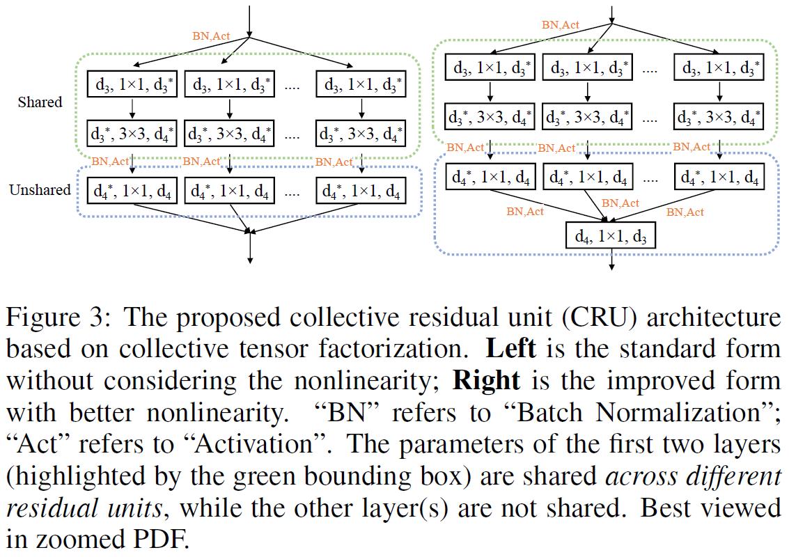
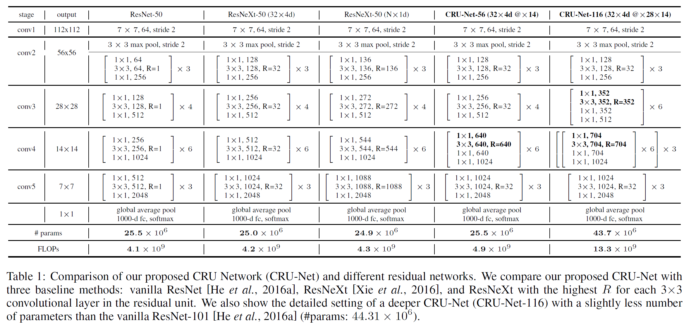

We plan to release these two modified architectures implemented by MXNet for image classification. 

# Modified CRUNet.mxnet
A MXNet implementation of modified CRUNet

In this part, we implement a modified CRU-Net (**CRU-Net 56, 116**) architecture via [MXNet](http://mxnet.io/). It is described in the paper [Sharing Residual Units Through Collective Tensor Factorization To Improve Deep Neural Networks](https://www.ijcai.org/proceedings/2018/0088.pdf) proposed by [Yunpeng Chen](https://github.com/cypw), Xiaojie Jin, Bingyi Kang, Jiashi Feng, Shuicheng Yan. This paper is accepted by IJCAI 2018.

## Original architecture

This is an illustration of a collective residual unit (CRU) building block.

The original CRU Networks (CRUNet 56 and CRUNet 116) are based on the following table:

We implement the modified CRU Networks based on original CRUNet 56 an CRUNet 116.

## What's the difference between modified version and original version ?
**1**. The size of input data is 112x112 not 224x224. In order to preserve higher feature map resolution, we follow the setting of input in [2]. Specifically, The first convolution layer with 7x7 kernel size and 2 stride is replaced by 3x3 kernel size and 1 stride. Moreover, 
we remove the following max pooling layer with 3x3 kernel size and 2 stride.

**2**. We adopt the improved residual unit mentioned in [2]. Specifically, the improved residual unit is constructed by BN-Conv-BN-PReLu-Conv-BN, where BN denotes batch normalization layer, PReLu is Parametric Rectified Linear Unit activation layer and Conv means convolution layer.

**3**. We replace all ReLu activation layers with PReLu activation layers in our whole architecture.

**4**. We follow the output setting mentioned in [2]. Specifically, we choose Option-E with structure of BN-Dropout-FC-BN after the last convolutional layer, where Dropout means dropout layer and FC denotes fully connected layer.

**This modified Collective Residual Unit Network architecture can be directly integrated into the library of [insightface](https://github.com/deepinsight/insightface).**

In order to verify the performance of our modified CRUNet 116, we train it with arcface loss on data given by deepinsight and deploy data mirror, data color and random crop augmentation and adopt 80 batch size on 8 GPUs. Finally,  
**LFW: 0.99867+-0.00180;  
CFP_FP: 0.98386+-0.00542;  
CFP_FF: 0.99729+-0.00216;  
CALFW: 0.95933+-0.01119;  
CPLFW:0.92833+-0.01624;  
AgeDB30: 0.97983+-0.00765.**  
All results come from the model trained at epoch 36. Please see this **[link](https://github.com/deepinsight/insightface/issues/215).**

## Reference

[1]  [Yunpeng Chen](https://github.com/cypw), Xiaojie Jin, Bingyi Kang, Jiashi Feng, Shuicheng Yan. ["Sharing Residual Units Through Collective Tensor Factorization To Improve Deep Neural Networks"](https://www.ijcai.org/proceedings/2018/0088.pdf) IJCAI 2018.

ImageNet Pre-trained models can be downloaded at author's [github](https://github.com/cypw/CRU-Net)

[2] Jiankang Deng, [Jia Guo](https://github.com/deepinsight/insightface), Stefanos Zafeiriou. ["ArcFace: Additive Angular Margin Loss for Deep Face Recognition"](https://arxiv.org/pdf/1801.07698v1.pdf)

# Modified Residual-Attention-Network.mxnet
A MXNet implementation of modified Residual Attention Network

## What's the difference between modified version and original version ?
**1**. The size of input data is 112x112 not 224x224. In order to preserve higher feature map resolution, we follow the setting of input in [2]. Specifically, The first convolution layer with 7x7 kernel size and 2 stride is replaced by 3x3 kernel size and 1 stride. Moreover, 
we remove the following max pooling layer with 3x3 kernel size and 2 stride.

**2**. We adopt the improved residual unit mentioned in [2]. Specifically, the improved residual unit is constructed by BN-Conv-BN-PReLu-Conv-BN, where BN denotes batch normalization layer, PReLu is Parametric Rectified Linear Unit activation layer and Conv means convolution layer.

**3**. We replace all ReLu activation layers with PReLu activation layers in our whole architecture.

**4**. We follow the output setting mentioned in [2]. Specifically, we choose Option-E with structure of BN-Dropout-FC-BN after the last convolutional layer, where Dropout means dropout layer and FC denotes fully connected layer.

**This modified Residual Attention Network architecture can be directly integrated into the library of [insightface](https://github.com/deepinsight/insightface).**

## Reference

[1] Fei Wang, Mengqing Jiang, Chen Qian, Shuo Yan, Chen Li, Honggang Zhang, Xiaogang Wang, Xiaoou Tang. ["Residual Attention Network for Image Classification"](https://arxiv.org/pdf/1704.06904.pdf) CVPR2017 Spotlight.

[Caffe implementation](https://github.com/fwang91/residual-attention-network)

[Pytorch implementation](https://github.com/tengshaofeng/ResidualAttentionNetwork-pytorch)

[2] Jiankang Deng, [Jia Guo](https://github.com/deepinsight/insightface), Stefanos Zafeiriou. ["ArcFace: Additive Angular Margin Loss for Deep Face Recognition"](https://arxiv.org/pdf/1801.07698v1.pdf)
